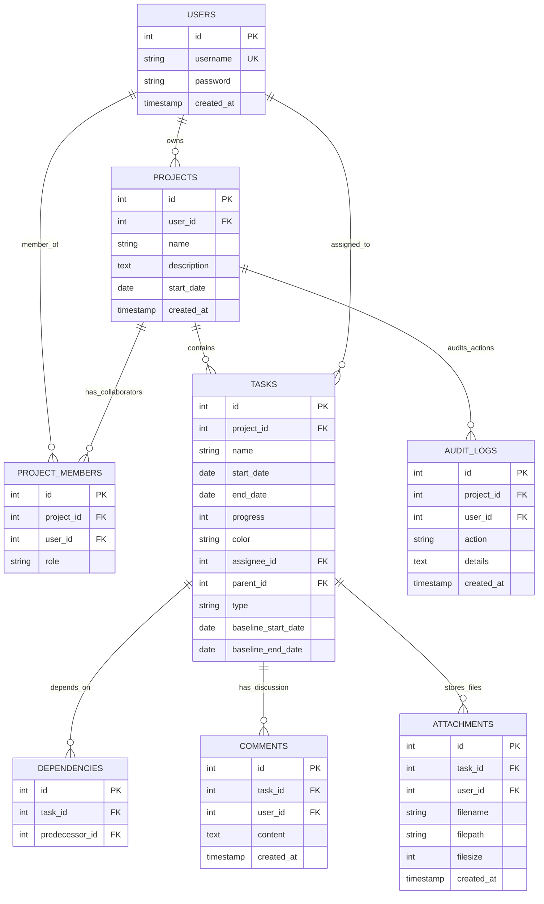

# 🎭 LAKON — Penjaga Alur Cerita Proyek Anda

> **Lupakan spreadsheet kaku dan manajemen proyek yang membosankan. LAKON mengubah setiap proyek menjadi babak cerita ("lakon"), di mana setiap tugas adalah adegan, kolaborator adalah para pemeran utama, dan progres adalah alur cerita yang berjalan. Sebuah visualisasi kerja berseni dengan estetika premium yang berkarakter kuat.**

---

## ⚡ Mengapa LAKON? (Keunikan & Karakter)

Di dalam LAKON, proyek Anda bukan sekadar tumpukan baris data. Kami merancangnya layaknya sebuah panggung pertunjukan teater, di mana setiap pergeseran peran dan waktu memengaruhi seluruh jalannya kisah.

### 🔄 Kaskade Alur Cerita (Cascade Engine)
Jika satu adegan (tugas) tertunda, adegan berikutnya tidak boleh tertinggal di masa lalu. Mesin kaskade LAKON menghitung jalannya alur cerita secara otomatis. Begitu jadwal satu tugas bergeser, seluruh alur cerita hilir (successor) akan ikut menyesuaikan secara dinamis, menjaga agar akhir cerita tetap selaras tanpa merusak plot pertunjukan.

### 👥 Penjaga Peran Ganda (The Over-allocation Sentinel)
Seorang aktor tidak bisa bermain di dua panggung terpisah pada jam yang sama. LAKON memantau beban jadwal pemeran secara real-time. Jika seorang kolaborator diberikan peran di beberapa adegan yang tumpang tindih pada hari yang sama, indikator beban mereka akan menyala **Merah Crimson** dengan lencana **`⚠️ Overallocated`**—melindungi tim Anda dari kelelahan mental.

### 👥 Bayang-Bayang Lakon (Baseline Gantt Shadowing)
Kunci naskah asli (baseline) Anda dengan sekali klik. Setiap perubahan pada alur cerita aktif akan memunculkan bayangan semi-transparan tepat di bawah bilah jadwal aktif, menunjukkan deviasi dari rencana awal panggung teater Anda secara sekilas.

### 📄 Lembar Laporan Sutradara (Executive Print Report)
Butuh presentasi ke produser atau pemangku kepentingan? Cukup tekan **Cetak (Print)** untuk menyembunyikan dasbor kerja dan menyusun dokumen formal **Laporan Sutradara (Project Status Report)**—lengkap dengan kartu metadata, indikator kunci alur, visualisasi lini masa, tabel beban aktor, dan catatan panggung.

---

## 🎨 Database Blueprint (Entity-Relationship)

Berikut adalah bagaimana relasi data bekerja di balik layar (dalam MySQL), diilustrasikan dengan analogi panggung teater:

* **PROJECTS** 🎭 *Lakon / Cerita Utama*
* **TASKS** 🎬 *Adegan / Babak Kerja*
* **USERS** 👥 *Pemeran / Tokoh*
* **PROJECT_MEMBERS** 📋 *Daftar Pemeran Proyek*
* **DEPENDENCIES** 🔗 *Keterkaitan Adegan*
* **COMMENTS** 💬 *Catatan Panggung / Umpan Balik*
* **ATTACHMENTS** 📦 *Kotak Properti / Media Locker*
* **AUDIT_LOGS** 📝 *Buku Harian Sutradara (Audit Log)*



---

## 🛠️ The Tech Stack

* **Core Engine**: Node.js + Express
* **Database Brain**: MySQL (`mysql2` connection pool)
* **Frontend Canvas**: Glassmorphic HTML5, Vanilla CSS, and native JavaScript
* **Authentication**: Express Session storage & `bcryptjs` password hashing
* **File Locker**: Disk uploads parsed via `multer`
* **Orchestration**: Docker & Compose

---

## 🚀 Speed Run Setup (Mulai dalam 60 Detik)

Pilih salah satu metode instalasi di bawah ini:

### Opsi A: Menggunakan Docker Compose (Direkomendasikan)
Pastikan Docker Desktop sudah aktif berjalan. Di direktori utama proyek Anda, jalankan perintah satu-baris berikut:
```bash
docker-compose up --build -d
```
> **Apa yang terjadi di balik layar?** Docker akan mengompilasi image aplikasi Node.js, mengunduh MySQL 8.0, menghubungkan DNS jaringan keduanya, secara otomatis memuat serta mengeksekusi skema database (`setup.sql` dan `upgrade.sql`) secara berurutan, dan menjalankan server di port **`3000`** sambil mengamankan data database serta unggahan di volume lokal persisten.

### Opsi B: Instalasi Lokal
1. **Siapkan Database**: Jalankan layanan MySQL (misalnya lewat Laragon atau XAMPP) pada port `3306`. Eksekusi skrip SQL berikut:
   ```bash
   mysql -u root -p < setup.sql
   mysql -u root -p < upgrade.sql
   ```
2. **Pasang Dependencies**:
   ```bash
   npm install
   ```
3. **Konfigurasi Environment (Opsional)**:
   Atur variabel lingkungan di terminal Anda atau buat berkas `.env` jika diperlukan:
   * `PORT` (bawaan `3000`)
   * `DB_HOST`, `DB_PORT`, `DB_USER`, `DB_PASSWORD`, `DB_NAME`
4. **Jalankan Aplikasi**:
   ```bash
   npm start
   ```
   Untuk mode pengembangan (hot-reloading):
   ```bash
   npm run dev
   ```

---

## 📝 CLI Controls & Operations

* **Bangun & Jalankan Kontainer**: `docker-compose up --build`
* **Hentikan Kontainer (Data Tetap Aman)**: `docker-compose down`
* **Hapus Volume & Reset Bersih**: `docker-compose down -v`
* **Lihat Log Server Aplikasi**: `docker-compose logs -f app`

---

## 🌟 Interactive Features Checklist

- [x] **Gerbang Keamanan**: Registrasi pemeran dan sesi terenkripsi.
- [x] **Daftar Tokoh Utama (Collaborator Hub)**: Pemilik lakon mengundang tokoh lain untuk membagi adegan kerja.
- [x] **Kaskade Alur Cerita**: Logika perhitungan jadwal yang otomatis mengalirkan perubahan ke adegan berikutnya.
- [x] **Poin Penting & Naskah Awal (Milestones & Baselines)**: Penanda batas babak (milestones) dan bayangan naskah awal untuk melihat deviasi alur.
- [x] **Kotak Properti Terintegrasi (Media Locker)**: Mengunggah/mengunduh lampiran (maks 10MB) dengan pembersihan otomatis saat dihapus.
- [x] **Laporan Cetak Sutradara**: Ekspor data dan cetak laporan status proyek dengan tata letak rapi siap cetak.

---

*LAKON — Merangkai alur cerita proyek, menyelaraskan pemeran, menyusun babak indah.*
